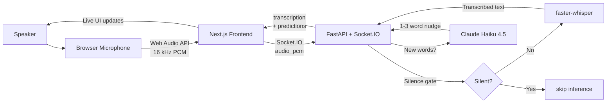
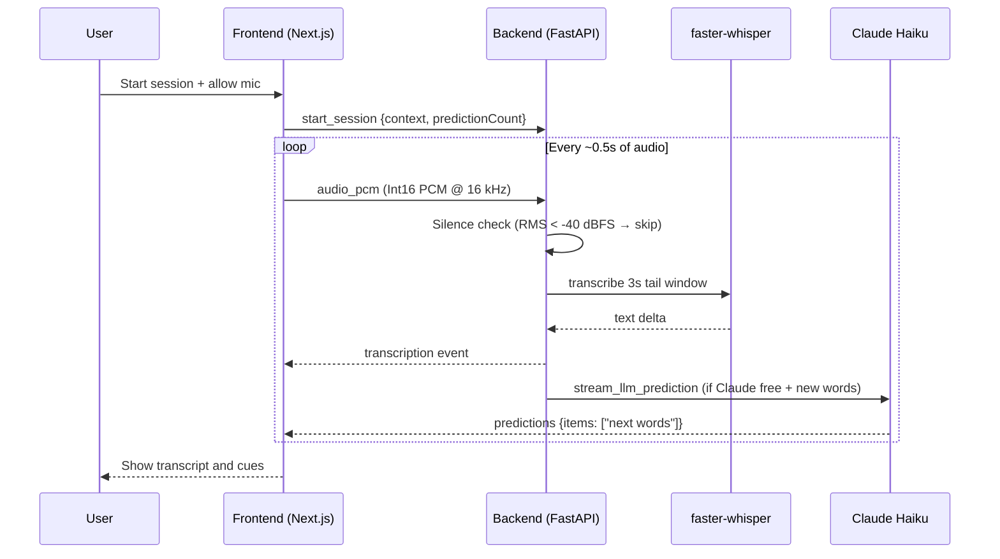
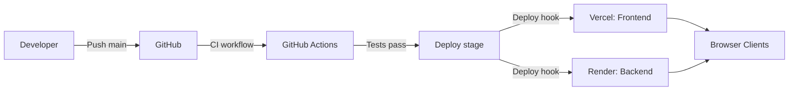

# Teleprompt

Real-time speech assistant that transcribes spoken audio and predicts the next 1–3 words to keep delivery natural when a speaker blanks mid-sentence.

## What It Does

- Captures microphone audio in the browser via the Web Audio API.
- Streams 16 kHz PCM audio to the backend over Socket.IO.
- Runs faster-whisper transcription on a 3-second sliding tail window (silence-gated — Whisper is skipped on quiet audio to prevent hallucinations).
- Streams 1–3 word nudges from Claude Haiku 4.5, scoped to the speaker's context notes.
- Debounces prediction: only fires a new Claude request when the previous one completes and new words have arrived.
- Emits live transcript updates and next-word cues to the frontend.

## Architecture

**High-level components**

- **Frontend**: Next.js app — session controls, microphone capture, waveform, transcript + prediction display.
- **Backend**: FastAPI + Socket.IO — audio buffering, Whisper inference, Claude streaming.
- **Models**: faster-whisper (CPU, `tiny.en` by default) for speech-to-text; Claude Haiku 4.5 for phrase prediction.

### System Overview



### Realtime Audio Pipeline



### Deployment Topology



## Tech Stack

- **Frontend**: Next.js 15, React 19, Socket.IO client, Tailwind CSS
- **Backend**: FastAPI, python-socketio, faster-whisper, NumPy, Anthropic SDK
- **Models**: faster-whisper `tiny.en` (CPU), Claude Haiku 4.5 (API)
- **Hosting**: Vercel (frontend), Render (backend)
- **CI/CD**: GitHub Actions + deploy hooks

## Local Development

### Backend

```bash
cd backend
python3 -m venv env
source env/bin/activate
pip install -r requirements.txt

# Set your Anthropic API key (required for Claude predictions)
cp .env.example .env   # then paste your key into .env
# or: echo "ANTHROPIC_API_KEY=sk-ant-..." > .env

uvicorn main:app --reload --port 8000
```

### Frontend

```bash
cd frontend
npm ci
npm run dev
```

Open `http://localhost:3000`. The frontend connects to `http://127.0.0.1:8000` by default.

## Environment Variables

**Frontend**

| Variable | Default | Description |
|---|---|---|
| `NEXT_PUBLIC_BACKEND_URL` | `http://127.0.0.1:8000` | Backend Socket.IO base URL |

**Backend**

| Variable | Default | Description |
|---|---|---|
| `ANTHROPIC_API_KEY` | *(none)* | Required for Claude Haiku predictions. Without it, falls back to bigram suggestions. |
| `TELEPROMPT_WHISPER_MODEL` | `tiny.en` | faster-whisper model name. Options: `base.en`, `small.en` for better accuracy. |

## Socket.IO Contract

**Client → Server**

| Event | Payload | Description |
|---|---|---|
| `start_session` | `{ context: string, predictionCount: number }` | Begin a new session with speaker notes |
| `audio_pcm` | `{ pcm: ArrayBuffer, client_sent_at_ms: number, batch_id: number }` | Raw Int16 PCM at 16 kHz |

**Server → Client**

| Event | Payload | Description |
|---|---|---|
| `connect_response` | `{ status: "connected", prediction_model: "claude-haiku" \| "basic" }` | Handshake — indicates whether Claude is active |
| `transcription` | `{ text?, current_word?, delta_text?, full_text?, batch_id?, transcribe_ms? }` | Live transcript update |
| `predictions` | `{ items: string[] }` | Next-word nudge (1–3 words from Claude, or bigram fallback) |
| `server_error` | `{ message: string }` | Runtime error |

## Audio Processing

- Audio accumulates in a double-buffer; Whisper inference fires every ~0.5 s of new audio.
- Transcription runs on the most recent 3-second tail window.
- Silence gate: if RMS of the tail window is below –40 dBFS, Whisper is skipped entirely.
- Claude prediction only fires when (a) the previous prediction has completed and (b) new words have arrived in the transcript — preventing API hammering on continuous speech.
- Fallback: if no `ANTHROPIC_API_KEY` is set, a bigram model provides basic next-word suggestions.

## Tests

```bash
# Backend (73 tests)
cd backend && env/bin/pytest tests/ -v

# Frontend (37 tests)
cd frontend && npm test
```

## Production Setup (One-Time)

1. **Render** (backend): Runtime `Python` · Root dir `backend` · Build `pip install -r requirements.txt` · Start `uvicorn main:app --host 0.0.0.0 --port $PORT` · Env vars: `ANTHROPIC_API_KEY`, optionally `TELEPROMPT_WHISPER_MODEL=base.en`.
2. **Vercel** (frontend): Root dir `frontend` · Framework Next.js · Env var `NEXT_PUBLIC_BACKEND_URL` = Render URL.
3. **Deploy Hooks**: Create in Render (Service Settings → Deploy Hook) and Vercel (Settings → Git → Deploy Hooks).
4. **GitHub Secrets**: Add `RENDER_DEPLOY_HOOK_URL` and `VERCEL_DEPLOY_HOOK_URL`.

## CI/CD

1. Push to `main` (or open a PR).
2. GitHub Actions runs frontend lint + test + build, and backend pytest + syntax check.
3. On `main` success, the deploy workflow triggers both Render and Vercel hooks.

## Project Layout

```
frontend/          Next.js client — UI, audio capture, Socket.IO
backend/           FastAPI + Socket.IO + Whisper + Claude
  routes/routes.py   Core pipeline: audio buffering, ASR, predictions
  tests/             73 pytest tests
architecture/      Audio pipeline and recorder design notes
.github/workflows/ CI/CD pipelines
render.yaml        Render service config
CLAUDE.md          Claude Code workflow guidelines
```

## Troubleshooting

- **Mic permission denied**: Re-enable microphone access in browser settings.
- **No transcript**: Confirm backend is running and `NEXT_PUBLIC_BACKEND_URL` is reachable.
- **"Basic predictions" shown**: `ANTHROPIC_API_KEY` is not set in `backend/.env`. Add it and restart the backend.
- **Socket disconnects**: Check CORS settings or reverse proxy timeouts.

## Security Notes

- CORS is currently configured as `*` for ease of development. Restrict `allow_origins` in production.
- `backend/.env` is gitignored. Never commit API keys.
