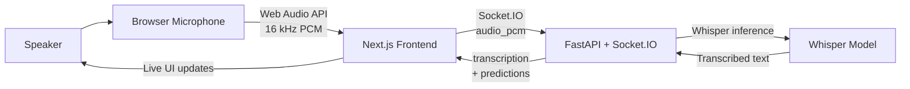
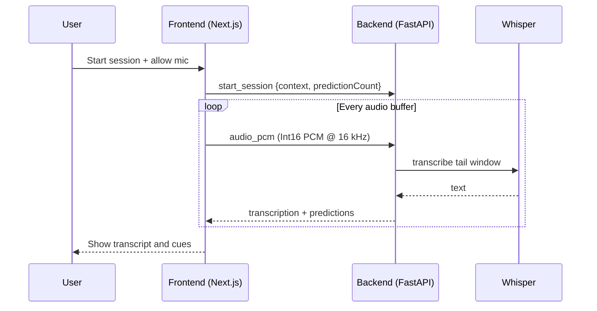
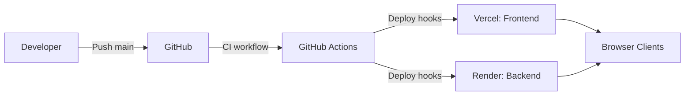

# Teleprompt

Realtime speech assistant that transcribes spoken audio and suggests next-word cues to keep delivery natural.

## What It Does

- Captures microphone audio in the browser.
- Streams 16 kHz PCM audio to the backend over Socket.IO.
- Runs Whisper transcription on a sliding window of recent audio.
- Emits live transcript updates and suggested next phrases.

## Architecture

**High-level components**

- **Frontend**: Next.js app that manages session controls, microphone capture, and UI updates.
- **Backend**: FastAPI + Socket.IO service that performs transcription and prediction.
- **Model**: OpenAI Whisper (CPU) for speech-to-text.

### System Overview



### Realtime Audio Pipeline



### Deployment Topology



## Tech Stack

- **Frontend**: Next.js 15, React 19, Socket.IO client, Tailwind CSS
- **Backend**: FastAPI, python-socketio, Whisper, Torch (CPU), NumPy
- **Hosting**: Vercel (frontend), Render (backend)
- **CI/CD**: GitHub Actions + deploy hooks

## Local Development

### Frontend

```bash
cd frontend
cp .env.example .env.local
npm ci
npm run dev
```

### Backend

```bash
cd backend
python3 -m venv .venv
source .venv/bin/activate
pip install -r requirements.txt
uvicorn main:app --reload --host 0.0.0.0 --port 8000
```

## Environment Variables

**Frontend**

- `NEXT_PUBLIC_BACKEND_URL`: Base URL for the backend Socket.IO server.

**Backend**

- `TELEPROMPT_WHISPER_MODEL`: Whisper model name (default: `tiny.en`). Examples: `base.en`, `small.en`.

## Socket.IO Contract

**Client -> Server**

- `start_session`: `context` (string), `predictionCount` (number, 1-10)
- `audio_pcm`: `ArrayBuffer` of Int16 PCM audio at 16 kHz

**Server -> Client**

- `connect_response`: `{ status: "connected" }`
- `transcription`: `{ text?, current_word?, delta_text?, full_text? }`
- `predictions`: `{ items: string[] }`
- `server_error`: `{ message: string }`

## Audio Processing Notes

- The backend aggregates audio and processes roughly every second.
- Transcription runs on a rolling ~6 second window for context.
- The UI displays the most recent words and suggested next phrases.

## Production Setup (One-Time)

1. **Render** (backend). Configure: Runtime `Python`. Root Directory `backend`. Build Command `pip install -r requirements.txt`. Start Command `uvicorn main:app --host 0.0.0.0 --port $PORT`. Optional env var `TELEPROMPT_WHISPER_MODEL=base.en`.
2. **Vercel** (frontend). Configure: Root Directory `frontend`. Framework Next.js. Env var `NEXT_PUBLIC_BACKEND_URL` set to the Render URL.
3. **Deploy Hooks**. Create hooks in Render (Service Settings -> Deploy Hook) and Vercel (Settings -> Git -> Deploy Hooks).
4. **GitHub Secrets**. Add `RENDER_DEPLOY_HOOK_URL` and `VERCEL_DEPLOY_HOOK_URL`.

## CI/CD Flow

1. Push to `main`.
2. GitHub Actions runs `CI` for frontend lint/build and backend syntax compile.
3. On success, `Deploy` workflow triggers both deploy hooks.

## Project Layout

- `frontend/` Next.js client UI
- `backend/` FastAPI + Socket.IO + Whisper inference
- `.github/workflows/` CI/CD pipelines
- `render.yaml` Render service configuration

## Troubleshooting

- **Mic permission denied**: Re-enable microphone access in the browser settings.
- **No transcript**: Confirm backend is running and `NEXT_PUBLIC_BACKEND_URL` is reachable.
- **Socket disconnects**: Check CORS settings or reverse proxy timeouts.

## Security Notes

- CORS is currently configured as `*` for ease of development.
- Restrict `allow_origins` in production environments.
