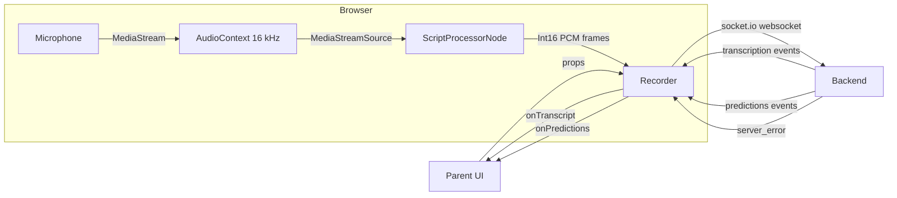
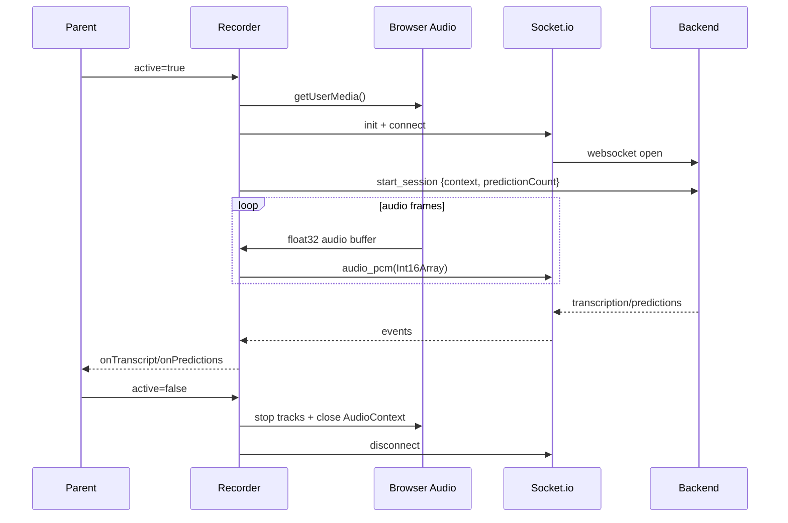

# Recorder Architecture and Flow

This document describes the architecture and runtime flow of `frontend/components/recorder.tsx`.

## Overview

`Recorder` is a client-side React component that:

- Captures microphone audio via `getUserMedia`
- Converts audio to 16kHz PCM (Int16)
- Streams audio to the backend via `socket.io`
- Receives live transcription snippets and prediction lists
- Exposes results upward through callbacks

## Major Components

- `Recorder` (React component)
- Browser Audio API
- Socket.io client
- Backend WebSocket endpoint
- Parent component callbacks

## Architecture Diagram (Mermaid)

## Data Flow

1. Parent renders `Recorder` with:
   - `context` (string)
   - `predictionCount` (number)
   - `onTranscript` (callback)
   - `onPredictions` (callback)
   - `active` (boolean)
2. When `active` changes to `true`, the component:
   - Requests microphone access
   - Initializes a socket client
   - Connects and emits `start_session`
3. Audio frames are processed:
   - Read from `ScriptProcessorNode`
   - Clamped and converted to `Int16Array`
   - Emitted as `audio_pcm` frames over the socket
4. Backend responds:
   - `transcription` events -> `onTranscript`
   - `predictions` events -> `onPredictions`
   - `server_error` -> local `error` state
5. When `active` becomes `false` (or on unmount):
   - Audio nodes are disconnected
   - Media tracks are stopped
   - Audio context is closed
   - Socket is disconnected

## Runtime Flow (Step-by-Step)

## State and Refs

- `isRecording` (state): UI indicator; true once audio pipeline is active
- `isConnected` (state): socket connection indicator
- `error` (state): displays last socket/server/microphone error
- `audioContextRef`: active `AudioContext` for resampling to 16kHz
- `processorRef`: `ScriptProcessorNode` used for PCM extraction
- `sourceNodeRef`: `MediaStreamAudioSourceNode` from microphone stream
- `streamRef`: `MediaStream` for stopping tracks
- `startInFlightRef`: prevents concurrent `startRecording` calls
- `wasActiveRef`: detects transitions of `active`
- `socket`: `socket.io` client instance

## Events and Payloads

- `start_session`
  - `{ context: string, predictionCount: number }`
- `audio_pcm`
  - `ArrayBuffer` of Int16 PCM samples
- `transcription`
  - `{ text?: string, current_word?: string, full_text?: string }`
- `predictions`
  - `{ items?: string[] }`
- `server_error`
  - `{ message?: string }`

## Notes and Constraints

- Uses `ScriptProcessorNode` (legacy Web Audio API). If upgraded to `AudioWorklet`,
  ensure the PCM conversion and socket emission remains equivalent.
- Uses a fixed `AudioContext` sample rate of `16000` to match backend expectations.
- Only connects the socket when recording starts; no reconnection logic is enabled.
